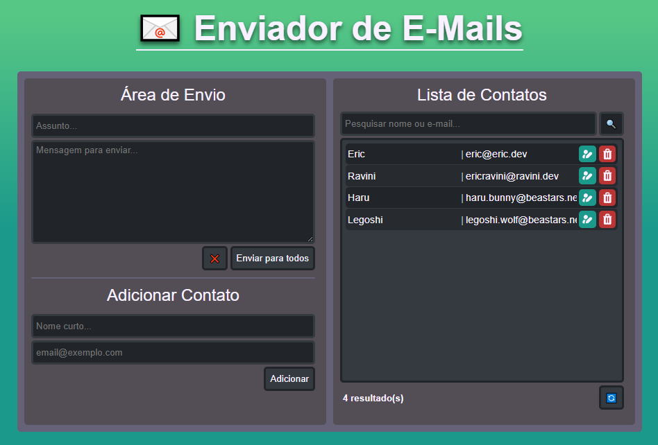

# 📧 Enviador de E-Mails (Projeto de Prática)

Este projeto foi desenvolvido para **praticar HTML, CSS, PHP, MySQL** e a arquitetura **MVC** com o auxílio do **Smarty** como template engine.  
O sistema simula o envio de e-mails para contatos cadastrados, servindo como um **projeto de portfólio** para demonstrar habilidades em desenvolvimento web.

⚠️ **Obs.:** o sistema não envia e-mails de verdade. A funcionalidade foi simulada apenas para fins de prática e estudo.

---

## ✨ Funcionalidades

- Adicionar contatos com **nome e e-mail**.  
- Listar todos os contatos cadastrados em uma base de dados local.  
- Escrever mensagens em uma área de envio e simular o envio para todos os contatos.  
- Estrutura organizada em **MVC com Smarty**, separando regras de negócio da camada de apresentação.  
- Responsividade em diferentes tamanhos de tela.

---

## 🖼️ Demonstração

  
*Exemplo da interface atual do projeto (em desenvolvimento).*

---

## 💻 Tecnologias Utilizadas

- **HTML5** – Estrutura da aplicação  
- **CSS3** – Estilização da interface  
- **PHP** – Lógica de backend  
- **MySQL** – Armazenamento dos contatos 
- **MVC (Model-View-Controller)** – Organização do projeto  
- **[Smarty](https://www.smarty.net/)** – Template engine para as views  

---

## 📂 Como Rodar o Projeto

1. Clone este repositório:
   ```bash
   git clone https://github.com/seu-usuario/seu-repositorio.git
   ```
2. Instale e inicie o [XAMPP](https://www.apachefriends.org/pt_br/index.html).
3. Mova o projeto para dentro da pasta `htdocs` do XAMPP.
4. Configure a database local (veja logo abaixo).
5. Acesse no navegador:
    ```perl
    http://localhost/caminho-para-o-projeto
    ```

---

## 🗄️ Configuração do Banco de Dados
1. Abra o [phpMyAdmin](http://localhost/phpmyadmin).
2. Vá até a aba **Importar**.
3. Selecione o arquivo `database.sql` (disponível neste repositório).
4. Clique em **Executar**.

Isso criará a database emails e a tabela contatos.

### Estrutura do Banco (database.sql):
```sql
  -- Criação da database
  CREATE DATABASE IF NOT EXISTS emails;
  USE emails;

  -- Criação da tabela de contatos
  CREATE TABLE IF NOT EXISTS contatos (
      id INT AUTO_INCREMENT PRIMARY KEY,
      nome VARCHAR(100) NOT NULL,
      email VARCHAR(150) NOT NULL,
      criado_em TIMESTAMP DEFAULT CURRENT_TIMESTAMP
  );
```

## 🔗 Conexão com o Banco
A conexão no PHP foi configurada para usar o localhost no XAMPP. 
O arquivo com as configurações de conexão está em `configs/conexao.php`.

## 📌 TODO
- [ ] Editar e deletar contatos
- [ ] Lista de contatos com páginas
- [X] Função de adicionar contatos
- [X] Função de pesquisar contatos na lista
- [X] Simular enviar mensagem
- [X] Deixar a interface responsiva com outros tamanhos de tela
- [X] Melhorar o design da interface

👤 By [Eric Ravini](github.com/ericravini)
